# Agents Module

The Agents module for Deno App Engine provides a comprehensive management interface to build and manage AI agents. Each agent can optionally be attached to a kernel for executing code during conversations.

## Features

- **Agent Management**: Create, configure, and manage multiple AI agents
- **Kernel Integration**: Optional code execution capabilities through kernel attachment
- **Conversation History**: Automatic conversation tracking and persistence
- **Event System**: Rich event system for monitoring agent activities
- **Streaming Support**: Real-time streaming of agent responses
- **Multiple Kernel Types**: Support for Python, TypeScript, and JavaScript kernels
- **Model Registry**: Centralized model configuration management with access controls

## Quick Start

```typescript
import { AgentManager, AgentEvents, KernelType } from "./agents/mod.ts";
import { KernelManager } from "./kernel/mod.ts";

// Create managers
const agentManager = new AgentManager({
  maxAgents: 10,
  autoSaveConversations: true,
  defaultKernelType: KernelType.PYTHON,
  modelRegistry: {
    "gpt4": {
      baseURL: "https://api.openai.com/v1/",
      apiKey: "your-api-key",
      model: "gpt-4o-mini",
      temperature: 0.7
    },
    "ollama-qwen": {
      baseURL: "http://localhost:11434/v1/",
      apiKey: "ollama",
      model: "qwen2.5-coder:7b",
      temperature: 0.5
    }
  },
  defaultModelId: "ollama-qwen",
  allowedModels: ["ollama-qwen"], // Restrict available models
  allowCustomModels: false // Force use of registry
});

const kernelManager = new KernelManager();
agentManager.setKernelManager(kernelManager);

// Create an agent using model from registry
const agentId = await agentManager.createAgent({
  id: "my-agent",
  name: "My Assistant",
  instructions: "You are a helpful coding assistant.",
  modelId: "ollama-qwen" // Use model from registry
});

// Get the agent and start a conversation
const agent = agentManager.getAgent(agentId)!;

const messages = [{
  role: "user" as const,
  content: "Calculate the factorial of 10 and show me the result"
}];

// Stream the conversation
for await (const chunk of agent.chatCompletion(messages)) {
  if (chunk.type === 'text') {
    console.log('Agent response:', chunk.content);
  } else if (chunk.type === 'function_call') {
    console.log('Executing code:', chunk.arguments?.code);
  } else if (chunk.type === 'function_call_output') {
    console.log('Code output:', chunk.content);
  }
}
```

## Core Concepts

### Simplified Reactive Loop Workflow

The agent system uses a streamlined "show don't tell" approach with reliable state tracking for handling conversations and code execution:

```mermaid
graph TD
    A["🚀 Start Loop"] --> B["📤 Send LLM Request"]
    B --> C["💬 Accumulate Full Response"]
    C --> D["🔍 Extract Script"]
    D --> E{"📜 Script Found?"}
    
    E -->|No| F["🎯 Set guidanceProvided = true"]
    F --> G["📝 Add Assistant Response to Messages"]
    G --> H["💡 Add Guidance Message"]
    H --> I["⚡ Yield 'guidance' Event"]
    I --> J["🔄 Continue Loop (no count increment)"]
    J --> B
    
    E -->|Yes| K{"🛡️ Code Handler Available?"}
    K -->|No| L["🚪 Break Loop with Script Content"]
    K -->|Yes| M["⚙️ Execute Code"]
    
    M --> N["🔍 Check Service Calls"]
    N --> O{"📞 returnToUser Called?"}
    
    O -->|Yes| P["🏁 Commit & Finish"]
    O -->|No| Q["📄 Add Execution Results"]
    Q --> R["➕ Increment Loop Count"]
    R --> S{"🔢 Max Steps Reached?"}
    S -->|Yes| T["⏰ Max Steps Exit"]
    S -->|No| B
    
    style F fill:#e1f5fe
    style I fill:#c8e6c9
    style M fill:#fff3e0
    style P fill:#e8f5e8
    style L fill:#fce4ec
```



**Key Improvements:**
- **Example-Driven**: Uses concrete examples instead of guidance text
- **Reliable State Tracking**: Tracks guidance state directly rather than parsing text
- **Simplified Logic**: Clear completion conditions with proper error handling
- **Non-Kernel Support**: Handles text-only agents without infinite loops
- **HyphaCore Integration**: Requires HyphaCore for kernel-based agents

### Agent Instance

Each agent is a self-contained AI assistant with:
- **Identity**: Unique ID, name, and description
- **Instructions**: System prompt that defines the agent's behavior
- **Kernel**: Optional code execution environment
- **Conversation History**: Automatic tracking of message exchanges
- **Settings**: Customizable LLM settings (model, temperature, etc.)

### Kernel Integration

Agents can be attached to kernels for code execution:
- **Python**: Execute Python code with Pyodide
- **TypeScript**: Execute TypeScript code
- **JavaScript**: Execute JavaScript code

### Event System

Monitor agent activities through events:
- `AGENT_CREATED`: New agent created
- `AGENT_MESSAGE`: Agent sent a message
- `AGENT_STREAMING`: Real-time message streaming
- `AGENT_CODE_EXECUTED`: Code execution completed
- `KERNEL_ATTACHED`: Kernel attached to agent
- `AGENT_ERROR`: Error occurred

## API Reference

### AgentManager

#### Constructor
```typescript
new AgentManager(options?: IAgentManagerOptions)
```

Options:
- `maxAgents`: Maximum number of agents (default: 50)
- `defaultModelSettings`: Default LLM settings
- `defaultMaxSteps`: Default maximum conversation steps
- `agentDataDirectory`: Directory for storing agent data
- `autoSaveConversations`: Auto-save conversation history
- `defaultKernelType`: Default kernel type for new agents
- `modelRegistry`: Model registry for centralized model configuration management
- `defaultModelId`: Default model ID for new agents
- `allowedModels`: Restricted models for new agents
- `allowCustomModels`: Control custom model usage

#### Methods

##### createAgent(config: IAgentConfig): Promise<string>
Create a new agent.

```typescript
const agentId = await manager.createAgent({
  id: "my-agent",
  name: "My Assistant",
  instructions: "You are a helpful coding assistant.",
  modelId: "ollama-qwen", // Use model from registry
  kernelType: KernelType.PYTHON,
  kernelEnvirons: {
    "API_KEY": "your-secret-key",
    "DEBUG_MODE": "true"
  },
  autoAttachKernel: true
});
```

##### getAgent(id: string): IAgentInstance | undefined
Get an agent instance by ID.

##### listAgents(): Array<AgentInfo>
List all agents with their basic information.

##### attachKernelToAgent(agentId: string, kernelType: KernelType): Promise<void>
Attach a kernel to an existing agent.

##### saveConversation(agentId: string): Promise<void>
Save agent's conversation history to disk.

##### loadConversation(agentId: string): Promise<ChatMessage[]>
Load agent's conversation history from disk.

### Agent Instance

#### Methods

##### chatCompletion(messages: ChatMessage[], options?: Partial<ChatCompletionOptions>): AsyncGenerator
Start a conversation with the agent.

```typescript
const agent = manager.getAgent("my-agent")!;

const messages = [{
  role: "user" as const,
  content: "Hello, how can you help me?"
}];

for await (const chunk of agent.chatCompletion(messages)) {
  switch (chunk.type) {
    case 'text':
      console.log('Response:', chunk.content);
      break;
    case 'function_call':
      console.log('Executing:', chunk.name, chunk.arguments);
      break;
    case 'function_call_output':
      console.log('Result:', chunk.content);
      break;
    case 'error':
      console.error('Error:', chunk.error);
      break;
  }
}
```

##### attachKernel(kernel: IKernelInstance): void
Attach a kernel instance to the agent.

##### detachKernel(): void
Detach the current kernel from the agent.

##### updateConfig(config: Partial<IAgentConfig>): void
Update the agent's configuration.

## Event Handling

```typescript
import { AgentEvents } from "./agents/mod.ts";

// Listen to agent events
manager.on(AgentEvents.AGENT_MESSAGE, (data) => {
  console.log(`Agent ${data.agentId} sent:`, data.message);
});

manager.on(AgentEvents.AGENT_CODE_EXECUTED, (data) => {
  console.log(`Agent ${data.agentId} executed code:`, data.code);
});

manager.on(AgentEvents.AGENT_ERROR, (data) => {
  console.error(`Agent ${data.agentId} error:`, data.error);
});
```

## Advanced Usage

### Custom Agent Settings

```typescript
const agentId = await manager.createAgent({
  id: "custom-agent",
  name: "Custom Agent",
  instructions: "You are a specialized data scientist assistant.",
  ModelSettings: {
    model: "llama3.1:70b",
    temperature: 0.3,
    baseURL: "http://localhost:11434/v1/",
    apiKey: "ollama"
  },
  maxSteps: 20
});
```

### Kernel Environment Variables

Agents can specify environment variables that will be available in their attached kernels:

```typescript
// Create an agent with kernel environment variables
const agentId = await manager.createAgent({
  id: "data-agent",
  name: "Data Analysis Agent",
  instructions: "You are a data scientist with access to various APIs.",
  kernelType: KernelType.PYTHON,
  kernelEnvirons: {
    "DATABASE_URL": "postgresql://localhost:5432/analytics",
    "API_KEY": "your-secret-api-key",
    "ENVIRONMENT": "development",
    "DEBUG_MODE": "true"
  },
  autoAttachKernel: true
});

// The agent can now access these environment variables in code execution
const agent = manager.getAgent(agentId)!;

const messages = [{
  role: "user" as const,
  content: "Check the database connection and API key configuration"
}];

for await (const chunk of agent.chatCompletion(messages)) {
  if (chunk.type === 'function_call' && chunk.name === 'execute_code') {
    // The agent might execute code like:
    // import os
    // db_url = os.environ.get('DATABASE_URL')
    // api_key = os.environ.get('API_KEY')
    // print(f"Database: {db_url}")
    // print(f"API Key configured: {'Yes' if api_key else 'No'}")
  }
}

// Environment variables are also available for TypeScript/JavaScript kernels
const tsAgentId = await manager.createAgent({
  id: "ts-agent",
  name: "TypeScript Agent",
  kernelType: KernelType.TYPESCRIPT,
  kernelEnvirons: {
    "NODE_ENV": "development",
    "API_ENDPOINT": "https://api.example.com"
  },
  autoAttachKernel: true
});

// In TypeScript kernels, environment variables are available via globalThis.ENVIRONS
// The agent can execute code like:
// const env = (globalThis as any).ENVIRONS?.NODE_ENV || 'production';
// const endpoint = (globalThis as any).ENVIRONS?.API_ENDPOINT;
// console.log(`Environment: ${env}, Endpoint: ${endpoint}`);
```

### Conversation Management

```typescript
// Auto-save conversations
const manager = new AgentManager({
  autoSaveConversations: true,
  agentDataDirectory: "./my_agents"
});

// Manual conversation management
await manager.saveConversation("agent-id");
const history = await manager.loadConversation("agent-id");
await manager.clearConversation("agent-id");
```

### Statistics and Monitoring

```typescript
// Get manager statistics
const stats = manager.getStats();
console.log(`Total agents: ${stats.totalAgents}`);
console.log(`Agents with kernels: ${stats.agentsWithKernels}`);
console.log(`Agents by kernel type:`, stats.agentsByKernelType);

// List all agents
const agents = manager.listAgents();
agents.forEach(agent => {
  console.log(`${agent.name}: ${agent.conversationLength} messages`);
});
```

## Error Handling

```typescript
try {
  const agentId = await manager.createAgent({
    id: "test-agent",
    name: "Test Agent"
  });
  
  const agent = manager.getAgent(agentId)!;
  
  for await (const chunk of agent.chatCompletion(messages)) {
    if (chunk.type === 'error') {
      console.error('Conversation error:', chunk.error);
      break;
    }
    // Handle other chunk types...
  }
} catch (error) {
  console.error('Agent creation failed:', error);
}
```

## Integration with Kernel Module

The agents module integrates seamlessly with the kernel module:

```typescript
import { AgentManager, KernelType } from "./agents/mod.ts";
import { KernelManager } from "./kernel/mod.ts";

// Setup
const kernelManager = new KernelManager();
const agentManager = new AgentManager();
agentManager.setKernelManager(kernelManager);

// Create agent with automatic kernel attachment
const agentId = await agentManager.createAgent({
  id: "python-expert",
  name: "Python Expert",
  kernel_type: KernelType.PYTHON,
  autoAttachKernel: true
});
```

## Best Practices

1. **Set reasonable limits**: Configure `maxAgents` and `maxSteps` based on your system resources
2. **Use descriptive instructions**: Clear system prompts improve agent behavior
3. **Monitor conversations**: Use events to track agent activities and errors
4. **Save important conversations**: Enable auto-save or manually save critical conversations
5. **Handle errors gracefully**: Always handle potential errors in async operations
6. **Choose appropriate kernels**: Match kernel types to your agent's intended use case 

## Model Registry

The Model Registry provides centralized management of model configurations with access controls and usage tracking.

### Key Features

- **Centralized Configuration**: Store model settings in a registry with unique IDs
- **Access Control**: Restrict which models agents can use via `allowedModels`
- **Custom Model Control**: Control whether agents can use custom model settings
- **Usage Tracking**: Monitor which models are being used by agents
- **Runtime Management**: Add, update, and remove models at runtime
- **Event System**: Monitor model registry changes

### Model Registry Configuration

```typescript
const agentManager = new AgentManager({
  // Initial model registry
  modelRegistry: {
    "fast-model": {
      baseURL: "http://localhost:11434/v1/",
      apiKey: "ollama",
      model: "qwen2.5-coder:7b",
      temperature: 0.3
    },
    "smart-model": {
      baseURL: "https://api.openai.com/v1/",
      apiKey: "your-api-key",
      model: "gpt-4o",
      temperature: 0.7
    }
  },
  
  // Default model from registry
  defaultModelId: "fast-model",
  
  // Restrict which models can be used
  allowedModels: ["fast-model"], // Only allow specific models
  
  // Control custom model usage
  allowCustomModels: false // Force use of registry models only
});
```

### Creating Agents with Models

```typescript
// Method 1: Use model ID from registry
const agent1 = await agentManager.createAgent({
  id: "agent-1",
  name: "Fast Agent",
  modelId: "fast-model" // Reference to registry
});

// Method 2: Use custom model settings (if allowed)
const agent2 = await agentManager.createAgent({
  id: "agent-2", 
  name: "Custom Agent",
  ModelSettings: {
    baseURL: "http://custom.api.com/v1/",
    apiKey: "custom-key",
    model: "custom-model",
    temperature: 0.8
  }
});
```

### Runtime Model Management

```typescript
// Add new model to registry
agentManager.addModel("new-model", {
  baseURL: "http://localhost:11434/v1/",
  apiKey: "ollama", 
  model: "codestral:22b",
  temperature: 0.2
});

// Update existing model
agentManager.updateModel("new-model", {
  baseURL: "http://localhost:11434/v1/",
  apiKey: "ollama",
  model: "codestral:22b", 
  temperature: 0.1 // Changed temperature
});

// Change agent's model
await agentManager.changeAgentModel("agent-1", "new-model");

// Remove unused model
agentManager.removeModel("old-model");

// Get model information
const modelEntry = agentManager.getModel("fast-model");
console.log(modelEntry?.modelSettings);

// List all models
const allModels = agentManager.listModels();
```

### Access Control

```typescript
// Set allowed models at runtime
agentManager.setAllowedModels(["fast-model", "new-model"]);

// Allow/disallow custom model settings
agentManager.setAllowCustomModels(true);

// Check if custom models are allowed
const canUseCustom = agentManager.getStats().modelRegistry.allowCustomModels;
```

### Model Statistics

```typescript
// Get detailed model statistics
const modelStats = agentManager.getModelStats();
console.log(`Total models: ${modelStats.totalModels}`);
console.log(`Models in use: ${modelStats.modelsInUse}`);

// Model usage details
modelStats.modelUsage.forEach(usage => {
  console.log(`${usage.id}: ${usage.agentsUsing} agents using ${usage.model}`);
});
```

### Model Events

```typescript
// Listen to model registry events
agentManager.on(AgentEvents.MODEL_ADDED, (data) => {
  console.log(`Model added: ${data.modelId}`);
});

agentManager.on(AgentEvents.MODEL_REMOVED, (data) => {
  console.log(`Model removed: ${data.modelId}`);
});

agentManager.on(AgentEvents.MODEL_UPDATED, (data) => {
  console.log(`Model updated: ${data.modelId}`);
});
``` 